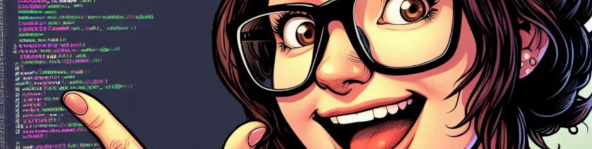

# Project Code and Dreams

    

## Aims
The aims of this project is to wish Amy all the best in the future and to acknowledge her as an inspiration throughout our training.
As a token gesture, a digital gift utilising some of our training would be most fitting, especially considering our journey through the training at the Code Institute as Cohort oct-2024-south-york-bootcamp (your fave!) .
 
 
So here it is: 
See the deployment [here](https://nickocaz.github.io/code-and-dreams/)!

## Design
View the deploy for more info

## Deployment
It's here.

## Testing
Due to squeezing this in during our capstone project..... as if! however, It's working.

## Technologies
* Crayola pens
* Bontempi organ
* The coffee machine

## Credits
* Amy 